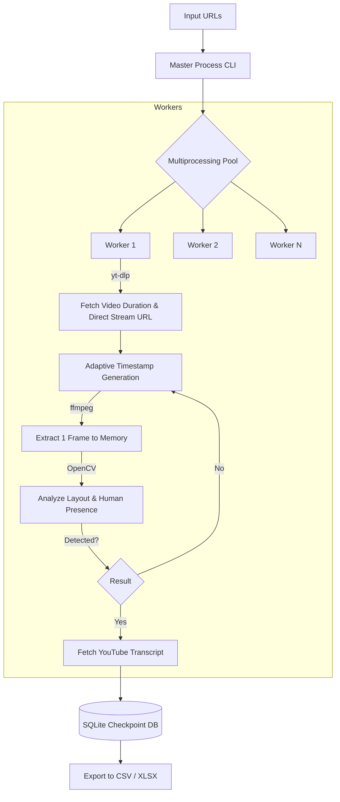

# YouTube Sign Language Interpreter Detector

## 1. Project Overview
This project is a production-grade, high-performance Python system that analyzes large numbers of YouTube news videos to detect if a sign language interpreter is present. Designed for massive scale (100,000+ videos), it uses a lightweight OpenCV-based layout heuristic rather than full video downloads or heavy AI models, prioritizing speed, low bandwidth, and low memory usage.

## 2. Architecture Diagram



## 3. Installation Guide

### Prerequisites
- **Python:** 3.9+
- **ffmpeg:** Must be installed on your system and accessible via the PATH. 
  - *Windows:* `winget install ffmpeg`
  - *Ubuntu:* `sudo apt install ffmpeg`

### Setup
1. Clone this repository.
2. Create a virtual environment:
   ```bash
   python -m venv venv
   source venv/bin/activate  # On Windows use `venv\Scripts\activate`
   ```
3. Install dependencies:
   ```bash
   pip install -r requirements.txt
   ```

## 4. Quick Start
To run a test with the included sample:
```bash
python main.py -i sample_urls.txt
```
This will read the URLs, process them in parallel, and output results into `output/results.csv` and `output/results.xlsx`.

## 5. Configuration
Modify `config.yaml` to tweak system behavior:
- `processing.num_workers`: Number of parallel video processing workers.
- `processing.max_splits`: Number of intervals to check before giving up.
- `detection.crop_left_ratio`: The portion of the screen (from the left) to analyze (default 0.40).
- `detection.confidence_threshold`: OpenCV confidence threshold to consider a positive match.

## 6. Input Format
Create a plain text file (`.txt`) with one YouTube URL per line. Lines starting with `#` are ignored. Example:
```text
https://www.youtube.com/watch?v=video1
https://www.youtube.com/watch?v=video2
```

## 7. Output Format
Exported as `results.csv` and `results.xlsx` containing:
- `video_url`: The original URL
- `detected`: "yes", "no", or "error"
- `transcript`: The cleaned transcript text (or "no")
- `detection_timestamp`: Timestamp in seconds where interpreter was found
- `frames_checked`: Total number of frames extracted
- `processing_time`: Total processing time for the video
- `transcript_language`: Language code (e.g., 'hi', 'en')
- `detection_confidence`: OpenCV confidence score
- `status`: "completed" or "failed"
- `error_message`: Stack trace or error string if failed

## 8. Performance Optimization
- **CPU vs GPU:** Currently optimized for CPU execution using lightweight Haar Cascades and HOG. This allows massive concurrency across many CPU cores without memory bottlenecking.
- **Network:** Uses `yt-dlp` to get direct `.m3u8` streams and extracts frames via `ffmpeg` fast-seek (`-ss` before `-i`). Full videos are never downloaded.
- **Memory:** `ffmpeg` pipes image bytes directly to OpenCV in-memory, avoiding disk I/O.

## 9. Resume & Recovery
- The system automatically creates a local SQLite database (`checkpoints.db`).
- If execution is interrupted (e.g., power failure), simply re-run the same command. The system will skip videos already marked as "completed".

## 10. Logging System
- Console output shows real-time progress.
- Detailed logs are written to `processing.log`.

## 11. Troubleshooting
- **ffmpeg issues:** Ensure `ffmpeg` is available in your PATH. Try running `ffmpeg -version` in your terminal.
- **Transcript failures:** If a transcript cannot be fetched, the `transcript` column will be "no". Some videos disable transcripts or API limits may apply.
- **Corrupted videos:** Handled gracefully. Video status will be marked as `failed` and logged in the DB, allowing the pipeline to continue.

## 12. Development Guide
- `src/video_utils.py`: Contains logic for adaptive timestamp generation.
- `src/detector.py`: Customize the OpenCV logic here (e.g., adding YOLO or MediaPipe).
- `src/frame_extractor.py`: Wrapper around ffmpeg for fast seeking.

## 13. Production Deployment
- For Linux deployment, consider using a `systemd` service or a `tmux` session for long-running executions.
- Can be containerized easily:
  ```dockerfile
  FROM python:3.10-slim
  RUN apt-get update && apt-get install -y ffmpeg
  WORKDIR /app
  COPY requirements.txt .
  RUN pip install -r requirements.txt
  COPY . .
  CMD ["python", "main.py", "-i", "urls.txt"]
  ```

## 14. Example Workflow
1. Prepare a file `news_videos.txt` with 10,000 URLs.
2. Edit `config.yaml` to set `num_workers: 16`.
3. Run `python main.py -i news_videos.txt`.
4. Monitor the console output.
5. Once finished, find the results in `output/results.xlsx`.

## 15. Future Improvements
- **Advanced AI Verification:** Add MediaPipe Pose/Hands detection as a fallback when OpenCV confidence is medium (0.4 to 0.7).
- **GPU CV Acceleration:** Incorporate YOLOv8 for precise bounding box detection if deployed on GPU-rich servers.
- **Distributed Queues:** Replace SQLite with Redis/Celery for multi-server processing.
- **Web Monitoring Panel:** Implement a Flask/FastAPI dashboard to monitor progress in real-time.
